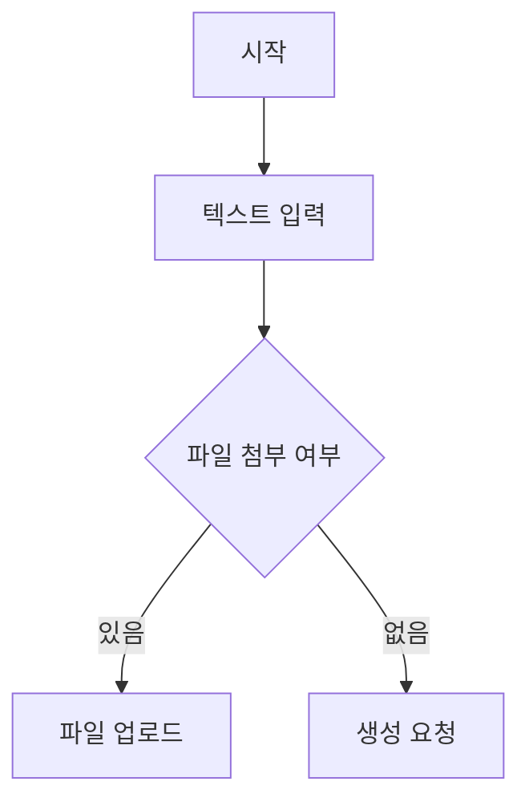

# PRD: 내부 AI 기획 요청 자동화 서비스

> **문서 버전:** v1.8
> **작성일:** 2026-06-25
> **상태:** Draft
> **변경 이력:**
> - v1.1 — Input 3단계 플로우 도입, 다운로드 기능 제거
> - v1.2 — Supabase DB 설계 섹션 신규 추가, Output 렌더링 명세 추가, DB 마이그레이션 방식 추가
> - v1.3 — 어드민 계정 생성 기반 인증 시스템 추가 (Supabase Auth, 최초 로그인 비밀번호 강제 변경)
> - v1.4 — 기능명세서 3개 뷰 구조 실제 매니패스트 기준으로 재정의 (트리뷰: react-flow 마인드맵, 디렉토리뷰: 3단 패널, 도큐먼트뷰: 테이블)
> - v1.5 — `/api/generate`를 단계별(request_id + output_type) 생성 방식으로 변경, 요청 이력 목록·재개(resume) 기능 추가, 기능명세서 도큐먼트뷰 컬럼을 실제 데이터 기준("비고")으로 정정, 유저플로우 프롬프트에 Mermaid 문법 충돌 방지 규칙 추가
> - v1.6 — 요청 이력에 수정(PATCH)·삭제(DELETE) 기능 추가 (수정 시 기존 Output 전체 삭제 후 PRD부터 재생성)
> - v1.7 — 헤더 네비게이션을 탭 형태로 재설계 (현재 페이지 활성 상태 표시, 서비스명과 네비게이션 분리)
> - v1.8 — MVP 배포 단계에서 와이어프레임 생성을 환경변수로 비활성화 (`ENABLE_WIREFRAME`/`NEXT_PUBLIC_ENABLE_WIREFRAME`, 기능 코드는 유지, Vercel 서버리스 타임아웃 회피 목적)

---

## 1. 프로젝트 개요

### 1.1 목적

본부 내 타 팀이 AI 솔루션·자동화 시스템 개발을 요청할 때 발생하는 **기획 단계의 모호함을 제거**하고, 요청자가 텍스트 또는 첨부 자료를 입력하면 PRD·기능명세서·유저플로우·와이어프레임을 자동으로 생성해주는 내부 기획 자동화 웹 서비스다.

Manifest(매니패스트)를 벤치마킹하여 UX 구조를 참고하되, 사내 업무 맥락에 최적화된 3단계 입력 플로우와 표준화된 Output 포맷을 제공한다.

### 1.2 문제 및 해결 방안

| 문제 | 해결 방안 |
|------|-----------|
| 타 팀의 AI 개발 요청이 추상적이고 구두로 전달되어 기획 공수 낭비 발생 | 3단계 입력 플로우(자유 텍스트 → 주요 기능 태그 → Claude 질문 응답)로 요청 구체화 강제화 |
| 기획 문서 포맷이 팀마다 달라 리뷰·검토 비효율 발생 | 표준화된 Output 템플릿(PRD→기능명세서→유저플로우→와이어프레임) 제공 |
| 요청 내용이 모호하여 Output 재생성 반복 발생 | Claude가 입력 분석 후 핵심 누락 항목만 객관식 질문으로 자동 생성, 재생성 최소화 |

### 1.3 타겟 사용자

- **주 사용자(요청자):** 본부 내 타 팀 구성원 (개발 역량 없음, 기획 경험 낮음)
- **보조 사용자(검토자):** AI 기획팀 구성원 (생성된 산출물을 검토·보완)

### 1.4 기술 스택

| 영역 | 기술 |
|------|------|
| 프론트엔드 | Next.js (App Router) |
| 백엔드 | FastAPI |
| AI | Anthropic Claude API (`claude-sonnet-4-6`) |
| 스타일링 | Tailwind CSS |
| DB | Supabase (PostgreSQL + Storage) |
| 인증 | Supabase Auth (이메일/비밀번호) |
| ORM | supabase-py |
| DB 마이그레이션 | SQL 마이그레이션 파일 + Python 실행 스크립트 |
| 파일 파싱 | python-docx, pdfplumber, openpyxl, Pillow |
| Output 렌더링 | react-markdown + remark-gfm (PRD), mermaid.js (유저플로우), react-flow (기능명세서 트리뷰) |

---

## 2. 기능 요구사항

### 2.1 인증 (Authentication)

회원가입 화면 없이 어드민이 계정을 직접 생성하고, 사용자는 발급받은 계정으로 로그인하는 방식으로 운영한다.

#### 2.1.1 계정 생성 (어드민 전용)

- 어드민(서비스 관리자)이 Supabase 대시보드에서 직원 이메일로 계정 직접 생성
- 초기 비밀번호: `123456` 일괄 설정
- 서비스 내 회원가입 화면 없음 — 허가된 직원만 접근 가능

#### 2.1.2 로그인

- 이메일 + 비밀번호 입력으로 로그인
- 최초 로그인 감지 시 비밀번호 변경 화면으로 강제 리다이렉트 (초기 비번 `123456` 그대로 사용 방지)
- 로그인 성공 후 서비스 메인 화면(Step 1) 진입

#### 2.1.3 비밀번호 변경

- 최초 로그인 시 강제 진입
- 이후에도 설정 메뉴에서 언제든 변경 가능
- 새 비밀번호 확인 입력 일치 여부 검증

#### 2.1.4 비밀번호 재설정

- 로그인 화면 하단 "비밀번호를 잊으셨나요?" 링크 제공
- 등록된 이메일로 재설정 링크 발송 (Supabase Auth 기본 제공)

#### 2.1.5 로그아웃

- 헤더 우측 사용자 메뉴에서 로그아웃 가능
- 로그아웃 시 로그인 화면으로 리다이렉트

---

### 2.2 Input — 3단계 요청 플로우

요청 단계의 모호함을 최소화하기 위해 입력을 3단계로 구조화한다.

#### 2.2.1 Step 1 — 자유 텍스트 입력 + 주요 기능 태그 입력

**자유 텍스트 입력 (조건부 필수)**
- 프로젝트 배경, 맥락, 아이디어를 자유롭게 작성하는 멀티라인 텍스트 에디터
- 플레이스홀더: `"어떤 것을 요청하고 싶으신가요? 꼭 필요한 주요 기능 1~3개를 함께 작성해주세요."`
- 예: 기존 기획 문서 내용, 회의록, 아이디어 메모 등

**주요 기능 태그 입력 (필수, 1~3개)**
- 요청자가 반드시 구현되어야 하는 핵심 기능을 태그 형태로 직접 입력
- 태그 입력 후 Enter 또는 콤마(`,`)로 구분하여 추가
- 최소 1개 미입력 시 다음 단계 진행 불가 (인라인 에러 메시지 표시)
- 예시 태그: `[회의록 요약]` `[액션아이템 추출]` `[Slack 자동 전송]`

**파일 첨부 (선택)**
- 지원 포맷: `.pdf`, `.docx`, `.hwp`, `.xlsx`, `.xls`, `.png`, `.jpg`, `.jpeg`
- 다중 파일 동시 업로드 / 드래그&드롭 지원
- 업로드 후 파일명 목록 표시 및 개별 삭제 가능
- 파일 크기 제한: 파일당 최대 200MB, 총 1GB

**입력 검증**
- 자유 텍스트 또는 파일 중 하나 이상 + 주요 기능 태그 1개 이상 필수
- 지원하지 않는 파일 포맷 업로드 시 에러 메시지 표시

---

#### 2.2.2 Step 2 — Claude 질문 자동 생성 (AI 사전 인터뷰)

- 요청자가 "분석 요청" 버튼 클릭 시 Claude가 Step 1 입력(텍스트 + 기능 태그 + 파일 내용)을 분석
- 이미 태그로 주요 기능이 입력되었으므로, Claude는 **누가 / 언제 / 어디서 / 어떻게 쓰는지** 등 업무 맥락 중심으로 질문
- 질문은 개발 지식이 없는 현업 직원도 바로 이해하고 답할 수 있는 언어로 생성
- 객관식 질문 **3개** 자동 생성 (매니패스트 질문지 방식 벤치마킹)
- 각 질문은 3개 이내 선택지 + "직접 입력" 옵션 포함
- 요청자는 질문에 모두 답하거나 "건너뛰기"로 스킵 가능

**질문 생성 예시** (회의록 자동화 요청 기준)
```
Q1. 회의가 끝난 뒤 결과를 어디서 확인하고 싶으신가요?
  ○ Slack 채널에 자동으로 올라왔으면 해요
  ○ 이메일로 받고 싶어요
  ○ 직접 입력

Q2. 이 서비스를 주로 누가 사용하게 되나요?
  ○ 우리 팀 내부에서만 (5명 이하)
  ○ 여러 팀이 함께 (10명 이상)
  ○ 직접 입력

Q3. 지금은 회의가 끝난 뒤 어떻게 정리하고 계신가요?
  ○ 담당자가 직접 문서로 작성해요
  ○ 따로 정리하지 않고 구두로만 공유해요
  ○ 직접 입력
```

---

#### 2.2.3 Step 3 — Output 생성 시작

- Step 2 질문 응답 완료 후 "기획서 생성" 버튼 클릭
- Step 1 + Step 2 응답 내용을 통합하여 Claude에 전달
- PRD → 기능명세서 → 유저플로우 → 와이어프레임 순으로 순차 생성 (SSE 스트리밍)

### 2.3 Output 생성

생성 우선순위: PRD → 기능명세서 → 유저플로우 → 와이어프레임 (순차 생성, 단계별 스트리밍 표시)

#### 2.3.1 PRD (1순위)
- **구성 항목:**
  1. 프로젝트 개요 (한 줄 정의, 제품 목표, 배경, 문제 및 해결 방안, 기술 스택)
  2. 기능 요구사항 (필수 / 중요 / 선택 우선순위 포함)
  3. UX/UI 요구사항 (레이아웃 구조, 인터랙션 원칙, 디자인 원칙)
  4. 폴더 구조
  5. API 설계 (엔드포인트 목록, 요청/응답 형식)
  6. Claude API 프롬프트 명세
  7. 환경변수 목록
  8. 실행 방법

#### 2.3.2 기능명세서 (2순위)
- **구성 항목:**
  - **트리뷰:** 전체 기능을 마인드맵 형태로 표시. 대분류 → 중분류 → 소분류가 가지치기로 연결되며 각 노드에 기능 ID 배지 표시. `react-flow` 기반 렌더링. "전체 보기" 버튼으로 전체 확장/축소 가능
  - **디렉토리뷰:** 3단 패널 구조
    - 좌측 패널: 요구사항 대분류 목록
    - 중간 패널: 선택한 대분류의 기능 목록 (기능 ID + 기능명 + 하위 기능 수)
    - 우측 패널: 선택한 기능의 상세 (기능 설명, 세부 기능별 우선순위·비고)
  - **도큐먼트뷰:** 전체 기능을 표(테이블) 형태로 정리. 기능 ID / 기능명 / 설명 / 우선순위 / 비고 컬럼 구성 (v1.5: "수용 기준"·"연결된 기능"은 6.4 프롬프트 출력 스키마에 해당 필드가 없어 "비고"로 정정)

#### 2.3.3 유저플로우 (3순위)
- **구성 항목:**
  - 기능별 플로우차트 자동 생성 (Mermaid 기반 렌더링)
  - 노드 텍스트 직접 수정 가능

#### 2.3.4 와이어프레임 (4순위, 선택)
- **구성 항목:**
  - 화면별 와이어프레임 + Description 팝업
  - 전체 페이지 목록 관리

### 2.4 Output 렌더링

생성된 Output은 마크다운·JSON 날것 텍스트가 아니라 **렌더링된 형태**로 사용자에게 표시된다.

| Output | 저장 형식 | 렌더링 방식 | 사용 라이브러리 |
|--------|-----------|-------------|-----------------|
| PRD | Markdown | 제목·표·목록·코드블록을 HTML로 변환하여 표시 | `react-markdown` + `remark-gfm` |
| 기능명세서 | JSON | 트리뷰: `react-flow` 마인드맵 / 디렉토리뷰: 3단 패널 / 도큐먼트뷰: 테이블 | `react-flow` + 커스텀 컴포넌트 |
| 유저플로우 | Mermaid 코드 | 플로우차트 다이어그램으로 렌더링 | `mermaid.js` |
| 와이어프레임 | HTML | 격리된 환경에서 실제 화면처럼 렌더링 | `iframe` / Shadow DOM |

> **v1.8:** 와이어프레임은 생성 시간이 길어 서버리스 배포 환경(Vercel)에서 타임아웃 위험이 있다. MVP 배포 단계에서는 `ENABLE_WIREFRAME`/`NEXT_PUBLIC_ENABLE_WIREFRAME` 환경변수로 생성·노출만 끄고, 기능 코드는 그대로 유지한다.

### 2.5 Output 저장

생성된 Output은 Supabase DB에 요청 이력과 함께 저장되어 언제든 재조회 가능하다.

| 저장 대상 | 저장 위치 | 비고 |
|-----------|-----------|------|
| 요청 내용 (텍스트, 기능 태그, 질문 응답) | Supabase DB `requests` 테이블 | |
| 생성된 Output 원문 | Supabase DB `outputs` 테이블 (JSONB) | PRD·기능명세서·유저플로우·와이어프레임 |
| 첨부 파일 | Supabase Storage | DB에는 파일 경로만 저장 |

---

## 3. UX/UI 요구사항

### 3.1 레이아웃 구조

```
[로그인 화면] ← 비로그인 시 모든 경로에서 리다이렉트
├── 이메일 + 비밀번호 입력
├── [로그인] 버튼
└── "비밀번호를 잊으셨나요?" 링크

[비밀번호 변경 화면] ← 최초 로그인 시 강제 진입
├── 새 비밀번호 입력
├── 새 비밀번호 확인 입력
└── [변경 완료] 버튼 → 메인 화면으로 이동

[헤더: 서비스명(브랜드 텍스트) + 네비게이션 탭(새 요청 / 요청 이력, 현재 페이지는 밑줄로 활성 표시, v1.7) + 우측 사용자 이메일 + 로그아웃]
│
├── [Step 1 화면: Input 영역] — 단일 카드 내 세 영역이 위→아래로 배치
│   ├── 요청 내용 (자유 텍스트, 멀티라인)
│   │   └── placeholder: "어떤 것을 요청하고 싶으신가요?
│   │                      배경, 현재 상황, 원하는 방향을 자유롭게 작성해주세요."
│   ├── 주요 기능 (태그 입력, 필수 1~3개)
│   │   ├── 입력창 안에 pill 태그가 쌓이는 구조
│   │   ├── Enter 또는 쉼표(,) 입력 시 태그로 변환
│   │   ├── 태그별 × 버튼으로 개별 삭제 가능
│   │   ├── 3개 도달 시 입력창 비활성화
│   │   └── placeholder: "기능 입력 후 Enter"
│   ├── 참고 자료 (파일 첨부, 선택)
│   │   └── 드래그&드롭 영역 (클릭 업로드 병행), 파일당 최대 200MB · 총 1GB
│   └── [분석 요청 →] 버튼 — 주요 기능 1개 이상 입력 시 활성화
│
├── [Step 2 화면: Claude 질문 응답]
│   ├── "입력 내용을 분석했어요. 아래 질문에 답해주시면 더 정확한 기획서를 만들 수 있어요."
│   ├── 객관식 질문 카드 3개 (선택지 + 직접입력 옵션)
│   ├── [건너뛰기] 버튼 (우측 하단, 텍스트 링크 형태)
│   └── [기획서 생성] 버튼
│
└── [Step 3 화면: Output 영역]
    ├── 탭: PRD | 기능명세서 | 유저플로우 | 와이어프레임
    └── 생성 진행 상태 표시 (Skeleton UI → 실제 콘텐츠)
```

### 3.2 인터랙션 원칙

- Step 1 → Step 2 전환 시 Claude 분석 중 로딩 인디케이터 표시 ("요청 내용을 분석하고 있어요...")
- Step 2 질문은 카드 형태로 하나씩 순차 표시 (한꺼번에 노출하여 부담 최소화)
- Step 3에서 각 Output이 순차적으로 스트리밍 방식으로 표시 (Skeleton UI → 실제 콘텐츠)
- 생성 중에도 이미 완료된 Output 탭은 즉시 확인 가능
- 오류 발생 시 해당 Output만 에러 메시지 표시, 나머지 Output 정상 제공
- 각 Step에서 이전 Step으로 돌아갈 수 있는 "뒤로가기" 제공

### 3.3 반응형

- 현재 버전은 데스크탑 웹 기준으로 개발 (최소 지원 해상도: 1280px)
- 단, 내부 사용자가 출퇴근 중 모바일로 요청을 작성하는 시나리오를 고려하여 모바일 대응 확장 가능성을 열어둠
- 향후 모바일 대응 시 우선 적용 범위: Step 1 입력 화면 (자유 텍스트 + 기능 태그 + 파일 첨부)
- Tailwind CSS의 반응형 유틸리티(`sm:`, `md:`) 를 초기부터 활용하여 레이아웃 구조가 모바일로 확장될 때 재작업 최소화

### 3.4 디자인 원칙

- 불필요한 장식 없이 콘텐츠 중심의 클린한 UI
- Step 진행 상태를 상단 Progress Bar로 시각화 (Step 1 / 2 / 3)
- 각 Output 섹션에 명확한 시각적 구분선 및 레이블 표시
- Step 2 질문 카드는 선택 시 즉시 하이라이트 처리로 선택 여부를 명확히 표현

---

## 4. 폴더 구조

```
project-root/
├── frontend/                          # Next.js App
│   ├── app/
│   │   ├── layout.tsx
│   │   ├── page.tsx                   # 메인 페이지 (Step 1~3 흐름 관리)
│   │   ├── login/
│   │   │   └── page.tsx               # 로그인 화면
│   │   ├── change-password/
│   │   │   └── page.tsx               # 최초 로그인 비밀번호 강제 변경 화면
│   │   ├── reset-password/
│   │   │   └── page.tsx               # 비밀번호 재설정 화면 (이메일 링크 경유)
│   │   ├── requests/                  # (v1.5 신규) 요청 이력
│   │   │   ├── page.tsx               # 전체 요청 이력 목록 + 삭제 (v1.6)
│   │   │   └── [id]/
│   │   │       ├── page.tsx           # 요청 상세 데이터 로딩
│   │   │       └── RequestDetailView.tsx  # 상세 렌더링 + 이어서 생성 + 수정/삭제 (v1.6)
│   │   └── globals.css
│   ├── components/
│   │   ├── auth/
│   │   │   ├── LoginForm.tsx          # 이메일 + 비밀번호 로그인 폼
│   │   │   ├── ChangePasswordForm.tsx # 비밀번호 변경 폼 (최초 강제 + 설정 메뉴)
│   │   │   └── ResetPasswordForm.tsx  # 비밀번호 재설정 요청 폼
│   │   ├── input/
│   │   │   ├── TextEditor.tsx         # 자유 텍스트 입력 영역
│   │   │   ├── FeatureTagInput.tsx    # 주요 기능 태그 입력 (필수, 1~3개)
│   │   │   └── FileUploader.tsx       # 파일 첨부 드래그&드롭
│   │   ├── interview/
│   │   │   ├── QuestionCard.tsx       # 객관식 질문 카드 단일 컴포넌트
│   │   │   └── InterviewStep.tsx      # Step 2 질문 목록 + 건너뛰기/생성 버튼
│   │   ├── output/
│   │   │   ├── OutputTabs.tsx         # PRD/기능명세서/유저플로우/와이어프레임 탭
│   │   │   ├── GenerationPanel.tsx    # (v1.5 신규) OutputTabs + 다음 단계 생성 버튼, Step3/요청 이력 재개 공용
│   │   │   ├── PrdView.tsx            # react-markdown으로 렌더링
│   │   │   ├── SpecView.tsx           # 기능명세서 뷰 컨테이너 (탭 전환 관리)
│   │   │   ├── spec/
│   │   │   │   ├── TreeView.tsx       # react-flow 마인드맵 렌더링
│   │   │   │   ├── DirectoryView.tsx  # 3단 패널 (대분류/기능목록/상세 팝업)
│   │   │   │   └── DocumentView.tsx   # 전체 기능 테이블 렌더링
│   │   │   ├── UserFlowView.tsx       # mermaid.js로 플로우차트 렌더링
│   │   │   └── WireframeView.tsx      # iframe으로 HTML 렌더링
│   │   ├── renderers/
│   │   │   ├── MarkdownRenderer.tsx   # react-markdown + remark-gfm 래퍼
│   │   │   └── MermaidRenderer.tsx    # mermaid.js 초기화 및 렌더링 래퍼
│   │   ├── common/
│   │   │   ├── StepProgressBar.tsx    # Step 1/2/3 진행 상태 표시
│   │   │   ├── SkeletonLoader.tsx
│   │   │   └── ErrorMessage.tsx
│   │   └── layout/
│   │       └── Header.tsx             # 서비스명 + 네비게이션 탭(새 요청/요청 이력, 현재 페이지 활성 표시, v1.7) + 사용자 이메일 + 로그아웃
│   ├── lib/
│   │   ├── api.ts                     # FastAPI 호출 유틸
│   │   ├── supabase.ts                # Supabase 클라이언트 초기화
│   │   └── config.ts                  # (v1.8 신규) NEXT_PUBLIC_ENABLE_WIREFRAME 등 기능 플래그
│   ├── hooks/
│   │   └── useGenerationFlow.ts       # (v1.5 신규) Output 생성 상태/SSE 처리 공용 훅
│   ├── middleware.ts                   # 비로그인 시 /login으로 리다이렉트
│   ├── types/
│   │   └── output.ts                  # Output 타입 정의
│   ├── tailwind.config.ts
│   ├── next.config.ts
│   └── package.json
│
└── backend/                           # FastAPI App
    ├── main.py                        # FastAPI 엔트리포인트
    ├── routers/
    │   ├── interview.py               # /interview 엔드포인트 (질문 생성)
    │   ├── generate.py                # /generate 엔드포인트 (Output 생성, output_type 단위)
    │   └── requests.py                # (v1.5 신규) /requests 목록·상세 조회 엔드포인트
    ├── services/
    │   ├── file_parser.py             # 첨부 파일 텍스트 추출
    │   ├── claude_service.py          # Claude API 호출 및 프롬프트 관리
    │   └── supabase_service.py        # Supabase DB 저장/조회
    ├── models/
    │   └── schemas.py                 # Pydantic 모델 정의
    ├── prompts/
    │   ├── interview_prompt.py        # 질문 생성 프롬프트
    │   ├── prd_prompt.py
    │   ├── spec_prompt.py
    │   ├── userflow_prompt.py
    │   └── wireframe_prompt.py
    ├── migrations/                    # DB 마이그레이션 SQL 파일
    │   ├── 001_create_users_table.sql
    │   ├── 002_create_requests_table.sql
    │   ├── 003_create_outputs_table.sql
    │   └── reset.sql                  # 전체 테이블 초기화
    ├── scripts/
    │   └── migrate.py                 # 마이그레이션 실행 스크립트 (up/down)
    ├── utils/
    │   └── text_cleaner.py
    ├── requirements.txt
    └── .env
```

---

## 5. API 설계

### 5.1 엔드포인트 목록

| Method | Path | 설명 |
|--------|------|------|
| POST | `/api/interview` | 텍스트 + 기능 태그 + 파일 → 객관식 질문 3개 생성 |
| POST | `/api/generate` | 전체 입력 + 질문 응답 → Output 생성 + DB 저장 (SSE 스트리밍) |
| GET | `/api/requests` | 요청 이력 목록 조회 |
| GET | `/api/requests/{request_id}` | 특정 요청의 Output 상세 조회 |
| PATCH | `/api/requests/{request_id}` | 요청 내용 수정 (기존 Output 전체 삭제, v1.6) |
| DELETE | `/api/requests/{request_id}` | 요청 및 모든 Output 삭제 (v1.6) |
| GET | `/api/health` | 서버 상태 확인 |

---

### 5.2 POST `/api/interview`

**요청 (application/json)**

파일은 프론트엔드가 Supabase Storage에 직접 업로드한 뒤, 그 경로만 아래 요청에 포함한다 (대용량 파일을 백엔드를 거쳐 두 번 업로드하지 않기 위함, v1.5에서 정정).

| 필드 | 타입 | 필수 | 설명 |
|------|------|------|------|
| `text` | string | 조건부 | 프로젝트 설명 자유 텍스트 |
| `features` | string[] | ✅ | 주요 기능 태그 (1~3개) |
| `file_paths` | string[] | 선택 | Supabase Storage에 업로드된 파일 경로 목록 |

**응답 (application/json)**

```json
{
  "questions": [
    {
      "id": "q1",
      "question": "이 시스템의 결과물은 어디로 전달되어야 하나요?",
      "options": ["Slack 채널", "이메일", "Notion 페이지", "직접 입력"]
    },
    {
      "id": "q2",
      "question": "주요 사용 부서와 인원 규모는?",
      "options": ["1~5명 소규모 팀", "10~30명 중규모 팀", "전사 공통 사용", "직접 입력"]
    },
    {
      "id": "q3",
      "question": "현재 이 업무를 어떻게 처리하고 있나요?",
      "options": ["수기로 직접 작성", "기존 자동화 도구 사용 중", "처리 방식 없음", "직접 입력"]
    }
  ]
}
```

---

### 5.3 POST `/api/generate`

> v1.5에서 한 번의 호출에 PRD~와이어프레임을 전부 순차 생성하던 방식에서, `output_type` 하나씩 생성하는 방식으로 변경됨 (사용자가 PRD만 필요한 경우 등 불필요한 토큰 소모를 막기 위함). 프론트엔드는 각 단계 완료 후 "OO 생성하기" 버튼으로 다음 단계를 직접 트리거한다.

**요청 (application/json)**

| 필드 | 타입 | 필수 | 설명 |
|------|------|------|------|
| `text` | string | 조건부 | 프로젝트 설명 자유 텍스트 |
| `features` | string[] | ✅ | 주요 기능 태그 (1~3개) |
| `file_paths` | string[] | 선택 | Supabase Storage 파일 경로 목록 |
| `interview_answers` | object[] | 선택 | Step 2 질문 응답 목록 `[{"id": "q1", "answer": "Slack 채널"}, ...]` |
| `output_type` | string | ✅ | 생성할 Output 종류 (`prd` \| `spec` \| `userflow` \| `wireframe`) |
| `request_id` | string | 선택 | 이미 생성된 요청에 이어서 생성할 때 전달 (없으면 새 요청 생성) |
| `prd_content` | string | 조건부 | `output_type`이 `spec`일 때 필수 |
| `spec_content` | string | 조건부 | `output_type`이 `userflow`일 때 필수 |
| `userflow_content` | string | 조건부 | `output_type`이 `wireframe`일 때 필수 |

**응답 (SSE: text/event-stream)**

```
event: request_created
data: {"request_id": "<신규 생성된 요청 ID>"}

event: prd_start
data: {}

event: prd_chunk
data: {"content": "## 개요\n..."}

event: prd_done
data: {"content": "<PRD 전체 마크다운>"}

event: error
data: {"output_type": "prd", "message": "생성 실패: ..."}

event: complete
data: {}
```

`request_created` 이벤트는 `request_id`를 전달하지 않은 최초 호출(PRD 생성)에서만 발생한다. 이후 단계는 항상 같은 `request_id`를 전달하여 동일 요청에 이어 붙인다.

---

### 5.4 GET `/api/requests`

전체 사용자의 요청 이력을 최신순으로 조회한다 (요청자/솔루션 기획자 구분 없이 로그인한 사용자라면 전체 공개, v1.5에서 결정).

**응답 (application/json)**

```json
[
  {
    "id": "<request_id>",
    "text": "...",
    "features": ["..."],
    "created_at": "2026-06-25T00:22:30Z",
    "completed_outputs": ["prd", "spec"]
  }
]
```

### 5.5 GET `/api/requests/{request_id}`

**응답 (application/json)**

```json
{
  "id": "<request_id>",
  "user_id": "<user_id>",
  "text": "...",
  "features": ["..."],
  "interview_answers": [{"id": "q1", "answer": "Slack 채널"}],
  "file_paths": ["..."],
  "created_at": "2026-06-25T00:22:30Z",
  "outputs": [
    {"type": "prd", "content": {"content": "<마크다운>"}, "created_at": "..."}
  ]
}
```

### 5.6 PATCH `/api/requests/{request_id}` (v1.6 신규)

요청 이력에서 원본 입력(텍스트/기능 태그/첨부 파일)을 수정한다. 수정된 입력으로는 기존에 생성된 PRD~와이어프레임이 더 이상 유효하지 않으므로, 저장된 Output을 전부 삭제한다 — 사용자는 PRD부터 다시 생성해야 한다.

**요청 (application/json)**

| 필드 | 타입 | 필수 | 설명 |
|------|------|------|------|
| `text` | string | 조건부 | 수정된 자유 텍스트 |
| `features` | string[] | ✅ | 수정된 주요 기능 태그 |
| `file_paths` | string[] | 선택 | 수정된 첨부 파일 경로 목록 |
| `interview_answers` | object[] | 선택 | Step 2 질문 응답 (보통 기존 값 유지) |

**응답:** 5.5와 동일한 형식 (단, `outputs`는 항상 빈 배열).

### 5.7 DELETE `/api/requests/{request_id}` (v1.6 신규)

요청과 연결된 모든 Output을 삭제한다. 응답 본문 없음 (204 No Content).

---

## 6. Claude API 프롬프트 명세

> 모든 프롬프트는 `claude-sonnet-4-6` 모델을 사용하며, `max_tokens: 4096`, `temperature: 0` 고정.

---

### 6.1 공통 시스템 프롬프트

```
당신은 B2B SaaS 기획 전문가입니다.
사용자가 제공하는 프로젝트 설명을 바탕으로 내부 AI 솔루션 기획 산출물을 작성합니다.
- 추측이 필요한 부분은 [가정: ...]으로 명시하세요.
- 전문 용어는 풀어서 설명하고, 실무에서 바로 사용 가능한 수준으로 작성하세요.
- 한국어로 작성하세요.
```

---

### 6.2 인터뷰 질문 생성 프롬프트 (신규)

```
아래 프로젝트 설명과 주요 기능 목록을 분석하여,
기획서 작성에 필요하지만 아직 명확하지 않은 항목을 파악하고
객관식 질문 정확히 3개를 JSON 형식으로 생성하세요.

[대상 사용자]
질문에 답하는 사람은 개발 지식이 없는 현업 직원입니다.
기술 용어(API, 연동, 파이프라인, 자동화 로직 등)를 사용하지 마세요.
"누가 / 언제 / 어디서 / 어떻게 쓰는지"처럼 업무 맥락 중심으로 질문하세요.
선택지도 실무에서 바로 와닿는 표현(도구명, 업무 상황, 빈도 등)으로 작성하세요.

[질문 생성 규칙]
- 주요 기능으로 이미 확인된 내용은 다시 묻지 마세요.
- 입력 내용을 분석하여 기획서 작성에 가장 불분명한 3가지를 Claude가 직접 판단하여 질문하세요.
- 아래 항목은 참고 기준이며, 입력 내용에 따라 더 중요한 항목이 있다면 우선적으로 선택하세요.
  · 누가 이 서비스를 사용하나요? (부서, 인원 규모)
  · 결과물을 어디서 확인하거나 받아야 하나요? (Slack, 이메일, 특정 문서 등)
  · 지금은 이 업무를 어떻게 처리하고 있나요?
  · 얼마나 자주 사용할 것 같나요?
  · 이 서비스가 없으면 어떤 불편함이 생기나요?
  · 이 서비스를 사용하기 위해 필요한 데이터나 자료가 있나요?
  · 결과물의 형태가 어떻게 되어야 하나요? (문서, 알림, 표 등)
  · 이 서비스를 언제 주로 사용할 것 같나요? (특정 시점, 상시 등)
- 위 항목에 해당하지 않더라도 기획서 작성에 꼭 필요한 정보라면 자유롭게 질문할 수 있습니다.
- 각 질문의 선택지는 3개 이하로 제한하고, 마지막 옵션은 반드시 "직접 입력"으로 설정하세요.
- JSON 외의 다른 텍스트는 출력하지 마세요.

출력 형식:
{
  "questions": [
    {
      "id": "q1",
      "question": "질문 내용",
      "options": ["선택지1", "선택지2", "직접 입력"]
    }
  ]
}

---
[주요 기능]
{features}

[프로젝트 설명]
{user_input}
```

**질문 생성 예시** (회의록 자동화 요청 기준)

```
Q1. 회의가 끝난 뒤 결과를 어디서 확인하고 싶으신가요?
  ○ Slack 채널에 자동으로 올라왔으면 해요
  ○ 이메일로 받고 싶어요
  ○ 직접 입력

Q2. 이 서비스를 주로 누가 사용하게 되나요?
  ○ 우리 팀 내부에서만 (5명 이하)
  ○ 여러 팀이 함께 (10명 이상)
  ○ 직접 입력

Q3. 지금은 회의가 끝난 뒤 어떻게 정리하고 계신가요?
  ○ 담당자가 직접 문서로 작성해요
  ○ 따로 정리하지 않고 구두로만 공유해요
  ○ 직접 입력
```

---

### 6.3 PRD 프롬프트

```
당신은 IT 서비스 기획 전문가입니다.
아래 프로젝트 설명, 주요 기능, 질문 응답 내용을 바탕으로 PRD를 마크다운 형식으로 작성하세요.

[작성 원칙]
- 추측이 필요한 부분은 [가정: ...]으로 명시하세요.
- 비개발자도 이해할 수 있도록 쉬운 언어로 작성하되, 기술 스택 항목은 아래 고정값을 그대로 사용하세요.
- 한국어로 작성하세요.

[고정 기술 스택 — 반드시 아래 값을 그대로 사용할 것]
- 프론트엔드: Next.js
- 백엔드: FastAPI
- AI: Anthropic Claude API (claude-sonnet-4-6)
- 스타일링: Tailwind CSS

반드시 아래 8개 항목을 모두 포함하세요:

---

## 1. 프로젝트 개요
### 1.1 목적
(서비스 한 줄 정의 / 제품 목표 / 배경 / 문제 및 해결 방안)

### 1.2 기술 스택
| 영역 | 기술 |
(위 고정 기술 스택을 테이블로 작성)

---

## 2. 기능 요구사항
(주요 기능을 중심으로 세부 기능 목록 작성. 필수 / 중요 / 선택 우선순위 포함)
- 필수: 없으면 서비스가 동작하지 않는 핵심 기능
- 중요: 있으면 좋지만 없어도 출시 가능한 기능
- 선택: 여유가 있을 때 추가할 기능

---

## 3. UX/UI 요구사항
### 3.1 레이아웃 구조
(주요 화면 구성을 트리 또는 텍스트로 표현)

### 3.2 인터랙션 원칙
(사용자 흐름 상 주요 인터랙션 명시)

### 3.3 디자인 원칙
(톤앤매너, 컴포넌트 스타일 방향)

---

## 4. 폴더 구조
(frontend / backend 디렉토리 트리. 고정 기술 스택 기준으로 작성)

---

## 5. API 설계
### 5.1 엔드포인트 목록
| Method | Path | 설명 |
(테이블 형식)

### 5.2 주요 엔드포인트 상세
(요청/응답 형식을 JSON 예시로 작성)

---

## 6. Claude API 프롬프트 명세
(기능별 시스템 프롬프트 및 유저 프롬프트 작성. 입력 변수는 {변수명} 형식으로 표기)

---

## 7. 환경변수 목록
| 변수명 | 예시 값 | 설명 |
(테이블 형식. ANTHROPIC_API_KEY 반드시 포함)

---

## 8. 실행 방법
(Backend 실행 / Frontend 실행 순서를 bash 명령어 포함하여 단계별로 작성)

---
[주요 기능]
{features}

[질문 응답 내용]
{interview_answers}

[프로젝트 설명]
{user_input}
```

---

### 6.4 기능명세서 프롬프트

```
아래 프로젝트 설명과 PRD를 바탕으로 기능명세서를 JSON 형식으로 작성하세요.

출력 형식:
{
  "features": [
    {
      "id": "F001",
      "category": "대분류명",
      "name": "기능명",
      "description": "기능 설명",
      "sub_features": [
        {
          "id": "F001-1",
          "name": "세부 기능명",
          "description": "세부 설명",
          "priority": "필수 / 중요 / 선택",
          "notes": "추가 코멘트"
        }
      ]
    }
  ]
}

JSON 외의 다른 텍스트는 출력하지 마세요.

---
[PRD]
{prd_content}

[프로젝트 설명]
{user_input}
```

---

### 6.5 유저플로우 프롬프트

```
아래 기능명세서를 바탕으로 핵심 기능의 유저플로우를 Mermaid flowchart 코드로 작성하세요.

규칙:
- 각 주요 기능별로 별도 flowchart 블록 작성
- 노드 ID는 영문 알파벳+숫자 조합 (예: A1, B2)
- 노드 텍스트는 한국어
- 분기(조건)는 菱形 노드로 표현
- 엣지 라벨(예: -->|라벨|)은 한 줄로 작성하고 파이프(|)나 줄바꿈을 포함하지 않는다
- 노드 텍스트(대괄호 [] 안)에 경로나 URL처럼 슬래시(/)가 포함되면 큰따옴표로 감싼다 (예: D3["/admin/login 으로 리다이렉트"])
- 코드 블록(```mermaid ... ```) 형식으로 출력

예시:


---
[기능명세서 JSON]
{spec_content}
```

---

### 6.6 와이어프레임 프롬프트

```
아래 유저플로우를 바탕으로 주요 화면의 와이어프레임을 HTML로 작성하세요.

규칙:
- 각 화면을 <section> 태그로 구분하고, data-page="화면명" 속성 추가
- 실제 색상 없이 회색(#eee, #ccc, #999) 계열만 사용하는 로우파이 와이어프레임
- Tailwind CSS CDN을 사용하여 스타일링
- 각 화면 상단에 화면명과 Description을 <div class="description"> 태그로 표시
- 전체 화면 목록을 최상단 <nav> 태그로 제공
- 완전한 HTML 문서(<!DOCTYPE html>부터 </html>까지) 형식으로 출력

---
[유저플로우 Mermaid 코드]
{userflow_content}
```

---

## 7. DB 설계 (Supabase)

### 7.1 테이블 구조

#### users (사용자 — Supabase Auth 자동 관리)

> Supabase Auth가 `auth.users` 테이블을 자동 생성·관리한다. 어드민이 Supabase 대시보드에서 직접 계정을 생성하며, 별도 회원가입 화면 없음.

| 컬럼 | 타입 | 설명 |
|------|------|------|
| `id` | UUID (PK) | 사용자 고유 ID (Supabase Auth 자동 생성) |
| `email` | TEXT | 사용자 이메일 |
| `is_first_login` | BOOLEAN | 최초 로그인 여부 (true: 비밀번호 변경 강제) |
| `created_at` | TIMESTAMP | 계정 생성 시각 |

#### requests (요청 이력)

| 컬럼 | 타입 | 설명 |
|------|------|------|
| `id` | UUID (PK) | 요청 고유 ID |
| `user_id` | UUID (FK → auth.users.id) | 요청한 사용자 ID |
| `text` | TEXT | 자유 텍스트 입력 내용 |
| `features` | TEXT[] | 주요 기능 태그 목록 |
| `interview_answers` | JSONB | Step 2 질문 응답 내용 |
| `file_paths` | TEXT[] | Supabase Storage 파일 경로 목록 |
| `created_at` | TIMESTAMP | 요청 생성 시각 |

#### outputs (생성된 Output)

| 컬럼 | 타입 | 설명 |
|------|------|------|
| `id` | UUID (PK) | Output 고유 ID |
| `request_id` | UUID (FK → requests.id) | 연결된 요청 ID |
| `type` | TEXT | Output 종류 (`prd` / `spec` / `userflow` / `wireframe`) |
| `content` | JSONB | 생성된 Output 원문 (Markdown, JSON, Mermaid, HTML) |
| `created_at` | TIMESTAMP | Output 생성 시각 |

### 7.2 마이그레이션

DB 구조는 SQL 마이그레이션 파일로 관리하며, 어느 Supabase 계정에서도 `.env`의 접속 정보만 변경하면 동일한 DB를 재현할 수 있다.

```bash
# 테이블 전체 생성 (신규 환경 세팅 시)
python scripts/migrate.py up

# 테이블 전체 삭제 (초기화 시)
python scripts/migrate.py down
```

마이그레이션 파일 구조:
```
backend/migrations/
├── 001_create_users_table.sql      # users 테이블 생성/삭제
├── 002_create_requests_table.sql   # requests 테이블 생성/삭제
├── 003_create_outputs_table.sql    # outputs 테이블 생성/삭제
└── reset.sql                       # 전체 테이블 일괄 초기화
```

> 마이그레이션 파일은 GitHub 레포지토리에 포함하여 팀원 누구든 동일한 DB 구조를 재현할 수 있도록 관리한다.

---

## 8. 환경변수 목록

### 8.1 Backend (`.env`)

| 변수명 | 예시 값 | 설명 |
|--------|---------|------|
| `ANTHROPIC_API_KEY` | `sk-ant-...` | Anthropic Claude API 키 |
| `CLAUDE_MODEL` | `claude-sonnet-4-6` | 사용 Claude 모델명 |
| `MAX_TOKENS` | `32000` | Claude 응답 최대 토큰 수 (v1.5: 실측 truncation으로 4096→32000 상향) |
| `MAX_FILE_SIZE_MB` | `200` | 파일당 최대 업로드 크기 (MB) |
| `MAX_TOTAL_FILE_SIZE_MB` | `1024` | 전체 파일 최대 업로드 크기 (MB) |
| `ALLOWED_ORIGINS` | `http://localhost:3000` | CORS 허용 Origin |
| `SUPABASE_URL` | `https://xxxx.supabase.co` | Supabase 프로젝트 URL |
| `SUPABASE_KEY` | `eyJ...` | Supabase 서비스 롤 키 |
| `ENV` | `development` | 실행 환경 (`development` / `production`) |
| `ENABLE_WIREFRAME` | `true` | 와이어프레임 생성 활성화 여부 (v1.8: MVP 배포 시 `false`) |
| `SUPABASE_DB_HOST` | `aws-0-xxxx.pooler.supabase.com` | DB 마이그레이션용 직접 Postgres 연결 (Session pooler) |
| `SUPABASE_DB_PORT` | `5432` | DB 마이그레이션용 포트 |
| `SUPABASE_DB_NAME` | `postgres` | DB 마이그레이션용 데이터베이스명 |
| `SUPABASE_DB_USER` | `postgres.xxxx` | DB 마이그레이션용 사용자명 |
| `SUPABASE_DB_PASSWORD` | - | DB 마이그레이션용 비밀번호 |

### 8.2 Frontend (`.env.local`)

| 변수명 | 예시 값 | 설명 |
|--------|---------|------|
| `NEXT_PUBLIC_API_BASE_URL` | `http://localhost:8000` | FastAPI 백엔드 베이스 URL |
| `NEXT_PUBLIC_SUPABASE_URL` | `https://xxxx.supabase.co` | Supabase 프로젝트 URL |
| `NEXT_PUBLIC_SUPABASE_ANON_KEY` | `eyJ...` | Supabase 익명 키 (프론트엔드용) |
| `NEXT_PUBLIC_ENABLE_WIREFRAME` | `true` | 와이어프레임 탭/생성 버튼 노출 여부 (v1.8: MVP 배포 시 `false`) |

---

## 9. 실행 방법

### 9.1 사전 요구사항

- Node.js 20 이상
- Python 3.11 이상
- pip
- Supabase 프로젝트 생성 및 URL·Key 확보

---

### 9.2 DB 마이그레이션 (최초 1회 또는 계정 변경 시)

```bash
cd backend

# 환경변수 설정 (.env에 SUPABASE_URL, SUPABASE_KEY 입력 후)
python scripts/migrate.py up      # 테이블 전체 생성

# DB 초기화가 필요할 때
python scripts/migrate.py down    # 테이블 전체 삭제
```

---

### 9.3 Backend 실행

```bash
# 1. 백엔드 디렉토리 이동
cd backend

# 2. 가상환경 생성 및 활성화
python -m venv venv
source venv/bin/activate        # Windows: venv\Scripts\activate

# 3. 의존성 설치
pip install -r requirements.txt

# 4. 환경변수 설정
cp .env.example .env
# .env 파일에 ANTHROPIC_API_KEY, SUPABASE_URL, SUPABASE_KEY 등 입력

# 5. 서버 실행
uvicorn main:app --host 0.0.0.0 --port 8000 --reload
```

FastAPI Swagger 문서: `http://localhost:8000/docs`

---

### 9.4 Frontend 실행

```bash
# 1. 프론트엔드 디렉토리 이동
cd frontend

# 2. 의존성 설치
npm install

# 3. 환경변수 설정
cp .env.local.example .env.local
# .env.local 파일에 NEXT_PUBLIC_API_BASE_URL, NEXT_PUBLIC_SUPABASE_URL, NEXT_PUBLIC_SUPABASE_ANON_KEY 입력

# 4. 개발 서버 실행
npm run dev
```

앱 접속: `http://localhost:3000`

---

### 9.5 requirements.txt (Backend 참고)

```
fastapi==0.115.0
uvicorn[standard]==0.30.0
anthropic==0.34.0
python-multipart==0.0.9
pydantic==2.8.0
pydantic-settings==2.4.0
python-docx==1.1.2
pdfplumber==0.11.4
openpyxl==3.1.5
Pillow==10.4.0
httpx==0.27.0
python-dotenv==1.0.1
supabase==2.5.0
```

---

### 9.6 package.json (Frontend 참고)

```json
{
  "dependencies": {
    "next": "^15.0.0",
    "react": "^19.0.0",
    "react-dom": "^19.0.0",
    "mermaid": "^11.0.0",
    "react-dropzone": "^14.3.0",
    "react-markdown": "^9.0.0",
    "remark-gfm": "^4.0.0",
    "@xyflow/react": "^12.0.0",
    "@supabase/supabase-js": "^2.45.0"
  },
  "devDependencies": {
    "typescript": "^5.5.0",
    "@types/react": "^19.0.0",
    "tailwindcss": "^3.4.0",
    "autoprefixer": "^10.4.0",
    "postcss": "^8.4.0"
  }
}
```

---

*본 PRD는 내부 팀 사용 기준으로 작성되었으며, 개발 착수 전 이해관계자 리뷰 및 확정이 필요합니다.*
